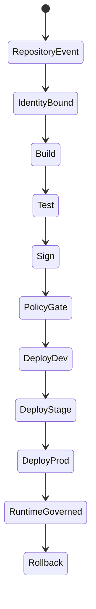

# CI/CD Engine

## Purpose

The GITORC CI/CD engine is a governed automation system, not a basic build runner. It links repository state, developer identity, pipeline actions, signed artifacts, environment promotion, and runtime policy.

## What the engine does

- Executes repository to build to test to artifact to deploy to runtime flows.
- Binds repository and actor identity to each pipeline run.
- Signs outputs before promotion.
- Gates promotion with RBAC, policy, and approval controls.
- Supports multi-environment delivery and rollback.

## How it works

1. A repository event triggers `.gitorc-ci.yml`.
2. Identity-binding verifies repository and actor context.
3. API and web validation run on governed runner infrastructure.
4. Artifacts are signed with `gitorc-secctl`.
5. OPA and deployment environment policy decide whether promotion can continue.
6. CD deploys the approved revision into dev, stage, or prod.
7. Rollback remains available as a governed action.

## Engine diagram

## Developer usage

- Define repository automation in `.gitorc-ci.yml`.
- Store deployment policy in `infra/deploy/environments`.
- Keep runtime governance in `infra/policy`.
- Validate private-cloud infrastructure before rollout with `make infra-validate`.

## How it connects to the rest of the system

- `gitorc-gateway` and `gitorc-git-service` provide the repository event surface.
- `gitorc-review-service` contributes review approval signals.
- `gitorc-ci-service` builds, tests, and signs.
- `gitorc-cd-service` handles promotion and rollback.
- OpenStack and Kubernetes provide the private execution plane.

## Examples

- Governed pipeline stages: `.gitorc-ci.yml`
- Runtime policy: `infra/policy/opa/runtime-governance.rego`
- Admission policy: `infra/policy/kyverno/verify-attestations.yaml`