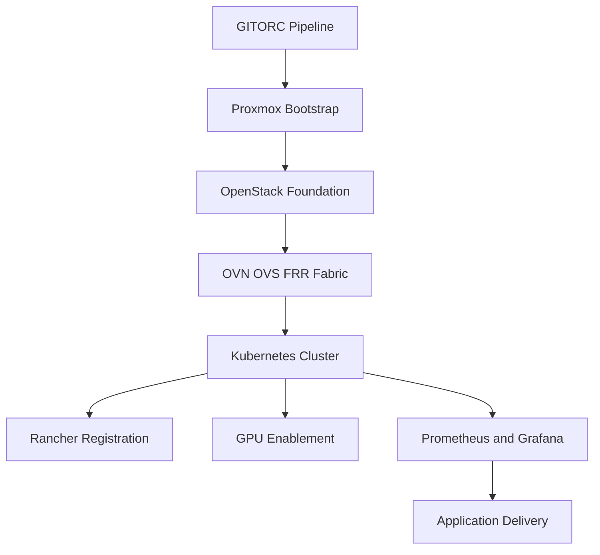

# Cloud Automation Workflows

## Purpose

GITORC is not the cloud platform. It is the CI/CD and automation layer that deploys and manages Proxmox VE, OpenStack, OVN/OVS, FRR, Kubernetes, Rancher, observability, and application workloads.

## What the workflows do

- Bootstrap bare-metal and VM-hosted Proxmox capacity.
- Prepare OpenStack controllers and compute nodes.
- Configure SDN and routing with OVN, OVS, and FRR.
- Prepare Kubernetes control-plane, worker, and GPU worker nodes.
- Register the resulting clusters in Rancher.
- Deploy Prometheus, Grafana, and platform workloads.
- Support automation execution on bare metal, Proxmox VMs, OpenStack VMs, Kubernetes pods, and GPU-attached worker nodes.

## How it works

1. Terraform provisions private-cloud primitives.
2. Ansible playbooks configure the operating environment on the hosts that make up the cloud stack.
3. Kubernetes manifests deploy GITORC, observability, Rancher integration helpers, and GPU device support.
4. Pipelines execute these steps as governed workflow lanes.

## Workflow diagram

## Developer usage

- Inventory: `infra/ansible/inventories/private-cloud/hosts.yml`
- Cloud bootstrap workflow: `infra/automation/workflows/cloud-bootstrap.yaml`
- Release workflow: `infra/automation/workflows/application-release.yaml`
- Rendered platform manifests: `infra/kubernetes/platform`

## Examples

- Proxmox bootstrap: `infra/ansible/playbooks/proxmox-bootstrap.yml`
- Network fabric: `infra/ansible/playbooks/network-fabric.yml`
- Rancher registration: `infra/ansible/playbooks/rancher-register.yml`
- GPU workers: `infra/ansible/playbooks/gpu-workers.yml`