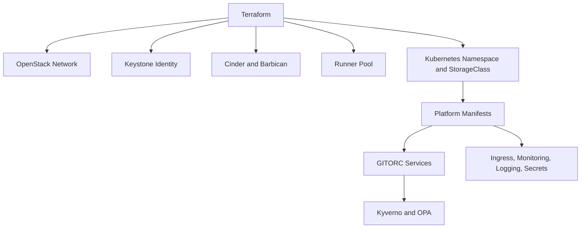

# Private-Cloud Deployment

## Purpose

This document defines how GITORC is deployed onto sovereign infrastructure using OpenStack, Kubernetes, Keystone, internal signing, and runtime governance.

## What the deployment stack does

- Provisions private-cloud networking, routing, floating IPs, and load-balancer ingress.
- Creates Keystone-scoped identities and service access patterns.
- Prepares Cinder and Ceph-backed storage for artifacts, logs, and runtime data.
- Deploys platform services, runner controllers, secrets sync, monitoring, and logging into Kubernetes.
- Enforces signed artifacts and environment promotion gates.

## How it works

1. Terraform provisions the OpenStack and Kubernetes foundation.
2. Kubernetes manifests deploy GITORC services and operational components.
3. Deployment environments encode promotion and rollback rules.
4. Kyverno and OPA block unapproved or unsigned runtime changes.

## Deployment diagram



## Developer workflow

```bash
cp infra/terraform/environments/private-cloud/terraform.tfvars.example infra/terraform/environments/private-cloud/terraform.tfvars
make infra-validate
terraform -chdir=infra/terraform/environments/private-cloud apply
make deploy-private-cloud
```

## How it connects to the rest of the system

- `gitorcapi` services run inside the target Kubernetes cluster.
- `.gitorc-ci.yml` drives the governed build, sign, promote, and rollback flow.
- `infra/policy` governs deployment admission and runtime authorization.
- `infra/deploy/environments` defines dev, stage, and prod rollout behavior.

## Examples

- OpenStack network module: `infra/terraform/modules/openstack-network`
- Kubernetes ingress: `infra/kubernetes/platform/ingress.yaml`
- Production promotion rules: `infra/deploy/environments/private-cloud-prod.yaml`