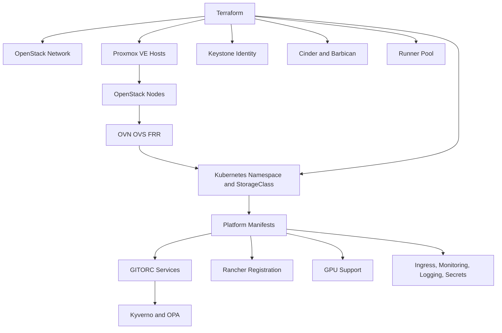

# Private-Cloud Deployment

## Purpose

This document defines how GITORC is deployed onto sovereign infrastructure using Proxmox VE, OpenStack, OVN and OVS, FRR, Kubernetes, Rancher, Keystone, internal signing, and runtime governance.

## What the deployment stack does

- Provisions private-cloud networking, routing, floating IPs, and load-balancer ingress.
- Boots Proxmox VE hosts for bare-metal and VM-backed capacity.
- Creates Keystone-scoped identities and service access patterns.
- Prepares Cinder and Ceph-backed storage for artifacts, logs, and runtime data.
- Configures OVN, OVS, and FRR for routed SDN fabrics.
- Deploys platform services, runner controllers, secrets sync, monitoring, and logging into Kubernetes.
- Registers Kubernetes clusters in Rancher.
- Enables GPU workers for accelerated CI/CD and workload execution.
- Enforces signed artifacts and environment promotion gates.

## How it works

1. Terraform provisions the OpenStack and Kubernetes foundation.
2. Ansible configures Proxmox VE hosts, network fabric, OpenStack nodes, Kubernetes nodes, Rancher registration, and GPU workers.
3. Kubernetes manifests deploy GITORC services and operational components.
4. Deployment environments encode promotion and rollback rules.
5. Kyverno and OPA block unapproved or unsigned runtime changes.

## Deployment diagram



## Developer workflow

```bash
cp infra/terraform/environments/private-cloud/terraform.tfvars.example infra/terraform/environments/private-cloud/terraform.tfvars
make infra-validate
terraform -chdir=infra/terraform/environments/private-cloud apply
make cloud-bootstrap
make deploy-private-cloud
```

## How it connects to the rest of the system

- `gitorcapi` services run inside the target Kubernetes cluster.
- `.gitorc-ci.yml` drives the governed build, sign, promote, and rollback flow.
- `infra/ansible` is the host-automation layer for hardware, VM, network, Rancher, and GPU preparation.
- `infra/policy` governs deployment admission and runtime authorization.
- `infra/deploy/environments` defines dev, stage, and prod rollout behavior.

## Examples

- OpenStack network module: `infra/terraform/modules/openstack-network`
- Kubernetes ingress: `infra/kubernetes/platform/ingress.yaml`
- Production promotion rules: `infra/deploy/environments/private-cloud-prod.yaml`