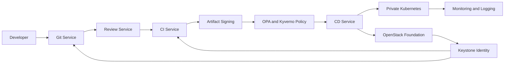

# gitorc platform architecture

## System shape

GITORC is a governed automation platform that links repository state, pipeline execution, signed artifacts, deployment promotion, and runtime policy in one private-cloud control plane.

## End-to-end flow

1. A developer pushes code into the Git service.
2. Review and repository policy bind the change to developer identity and repository governance.
3. CI runs build, test, package, and signing stages using dedicated private-cloud runners.
4. Signed artifacts are checked against runtime policy before promotion.
5. CD deploys approved revisions into dev, stage, and prod environments on private Kubernetes clusters.
6. Monitoring, logging, and audit records remain attached to the same repository and pipeline identity chain.

## Architecture diagram

## Infrastructure layers

- OpenStack provides networks, routers, floating IPs, load-balancer ingress, Cinder-backed storage classes, runner compute pools, and Keystone identity.
- Kubernetes runs the CI/CD control plane, ingress, runners, storage integration, monitoring, logging, and policy enforcement.
- Postgres, Redpanda, HBase, and HDFS back metadata, events, and artifact/log persistence for local bootstrap and platform services.

## Governance model

- Every pipeline run is repository-linked and actor-linked.
- Artifact promotion requires signed outputs.
- Stage and production promotion require approval and policy evaluation.
- Runtime admission rejects unsigned or unapproved workloads.

## Key repo entry points

- `infra/terraform/environments/private-cloud`: private-cloud provisioning.
- `infra/kubernetes/platform`: cluster-level platform services.
- `infra/policy`: attestation and runtime governance.
- `.gitorc-ci.yml`: governed pipeline lanes.
